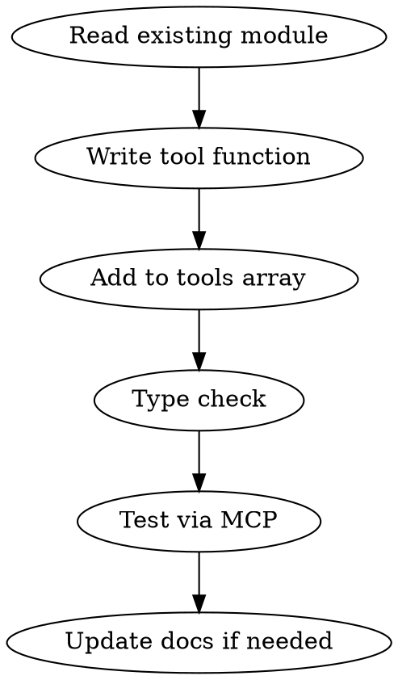

# Add MCP Tool

MCP 서버에 새 도구를 추가하는 워크플로우.

## Parameters

| 파라미터 | 필수 | 기본값 | 설명 |
|---------|------|--------|------|
| module | O | - | 도구가 속할 모듈 (dashboard, wiki, etf, ryuha, willow-mgmt, tensw-mgmt 등) |
| tool_name | O | - | 도구 이름 (snake_case, 접두사 포함) |
| description | O | - | 도구 설명 (한국어 가능) |
| operation | O | - | CRUD 유형 (list, get, create, update, delete) |

## File Locations

| 파일 | 경로 | 역할 |
|------|------|------|
| 도구 정의 | `src/lib/mcp/tools/{module}.ts` | 도구 함수 + 스키마 |
| MCP 서버 | `src/lib/mcp/server.ts` | 도구 등록 |
| API Route | `src/app/api/mcp/route.ts` | HTTP 엔드포인트 |

## Module Prefixes

| 모듈 | 접두사 | 예시 |
|------|--------|------|
| etf (akros) | `akros_` | `akros_list_products` |
| etf (etc) | `etc_` | `etc_list_todos` |
| ryuha | `ryuha_` | `ryuha_list_homework` |
| willow-mgmt | `willow_` | `willow_create_task` |
| tensw-mgmt | `tensw_` | `tensw_list_projects` |
| wiki, dashboard, projects | (없음) | `list_wiki_notes` |
| real-estate | `re_` | `re_get_summary` |

## Workflow



### 1. 기존 모듈 확인
```bash
# 해당 모듈 파일 읽기
cat src/lib/mcp/tools/{module}.ts
```
- 기존 도구 패턴, Supabase 클라이언트 사용법, 응답 형식 확인

### 2. 도구 함수 작성
기존 패턴을 따라 작성:
```typescript
// 패턴: { name, description, inputSchema, handler }
{
  name: "prefix_tool_name",
  description: "도구 설명",
  inputSchema: {
    type: "object" as const,
    properties: {
      param1: { type: "string", description: "파라미터 설명" }
    },
    required: ["param1"]
  },
  handler: async (params: Record<string, unknown>) => {
    // Supabase 쿼리
    const { data, error } = await supabase
      .from('table')
      .select('*');

    if (error) throw error;
    return { content: [{ type: "text", text: JSON.stringify(data, null, 2) }] };
  }
}
```

### 3. tools 배열에 등록
모듈 파일의 `export const xxxTools = [...]` 배열에 추가.
이미 server.ts에서 모듈별로 import하고 있으므로 별도 등록 불필요.

### 4. 타입 체크
```bash
cd /Volumes/PRO-G40/app-dev/willow-invt
npx tsc --noEmit
```

### 5. 테스트
MCP 도구를 직접 호출하여 결과 확인.

## Common Mistakes
- `as const` 누락 → inputSchema 타입 에러
- Supabase 클라이언트를 잘못 선택 (experiment-apps vs supernova)
- 응답 형식 불일치 → `{ content: [{ type: "text", text: string }] }` 필수
- 접두사 누락/불일치 → 모듈 내 일관성 깨짐
