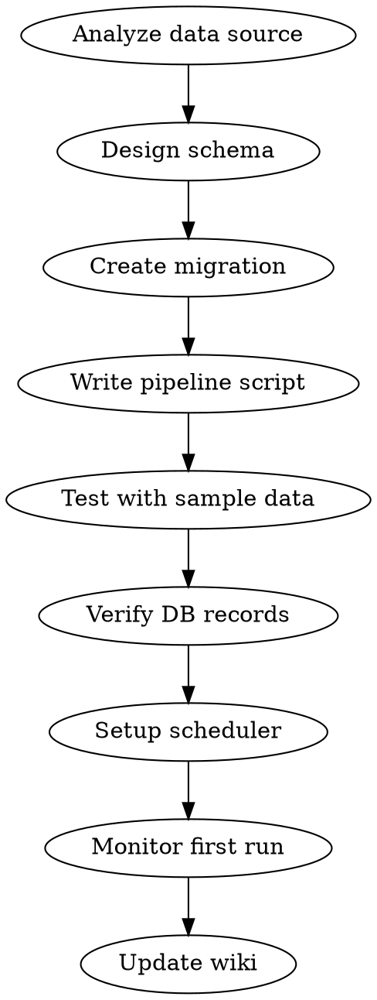

# Data Pipeline

외부 API/소스에서 데이터를 수집하여 Supabase에 저장하는 파이프라인 구축 워크플로우.

## Parameters

| 파라미터 | 필수 | 기본값 | 설명 |
|---------|------|--------|------|
| source | O | - | 데이터 소스 (API, 스크래핑 등) |
| target_project | O | - | Supabase 프로젝트 |
| target_table | O | - | 저장할 테이블 |
| schedule | X | - | 실행 주기 (launchd 또는 vercel cron) |
| script_name | O | - | 스크립트 파일명 |

## Existing Pipelines

| 이름 | 소스 | 테이블 | 스케줄 | 방식 |
|------|------|--------|--------|------|
| 13F 데이터 | SEC EDGAR | ria_firms | 수동 | Python 스크립트 |
| 부동산 실거래가 | 국토부 API | re_trades, re_rentals | 매일 07:13 | Vercel Cron |
| 네이버 매물 | 네이버 부동산 | re_naver_listings | 매일 08:00 | launchd |
| 부동산 시세 | 네이버 시세 | re_naver_prices | 매일 08:30 | launchd |

## Workflow



### 1. 데이터 소스 분석
- API 문서 확인 (인증, rate limit, 응답 형식)
- 데이터 볼륨 추정
- 증분(incremental) vs 전체(full) 동기화 결정

### 2. 스키마 설계
→ `supabase-migration` 스킬 사용
- upsert용 unique constraint 설계 (중복 방지)
- 인덱스 설계 (조회 패턴 기반)
- created_at, updated_at 자동 관리

### 3. 파이프라인 스크립트 작성
```typescript
// scripts/{script-name}.ts
import { createClient } from '@supabase/supabase-js';

const supabase = createClient(
  process.env.NEXT_PUBLIC_SUPABASE_URL!,
  process.env.SUPABASE_SECRET_KEY!  // service_role (RLS 우회)
);

async function main() {
  console.log(`[${new Date().toISOString()}] Pipeline start`);

  // 1. 데이터 가져오기
  const data = await fetchFromSource();

  // 2. 변환
  const records = transform(data);

  // 3. Supabase upsert
  const { error } = await supabase
    .from('target_table')
    .upsert(records, { onConflict: 'unique_key' });

  if (error) throw error;
  console.log(`[${new Date().toISOString()}] Upserted ${records.length} records`);
}

main().catch(console.error);
```

### 4. .env 로드
스크립트에서 환경변수 로드:
```typescript
import dotenv from 'dotenv';
import path from 'path';
dotenv.config({ path: path.resolve(__dirname, '../.env.local') });
```

### 5. 테스트
```bash
cd /Volumes/PRO-G40/app-dev/willow-invt
npx tsx scripts/{script-name}.ts
```
- 소량 데이터로 먼저 테스트
- DB에 레코드 확인 (MCP execute_sql)

### 6. 스케줄러 등록
실행 환경에 따라 선택:
- **서버 필요 없음 (로컬 실행)** → `setup-launchd-scheduler` 스킬
- **서버에서 실행** → `vercel-cron-setup` 스킬

### 7. 모니터링
- 첫 자동 실행 후 로그 확인
- 에러 시 텔레그램 알림 추가 고려

## Upsert 패턴
```typescript
// 단일 unique key
.upsert(records, { onConflict: 'id' })

// 복합 unique key (migration에서 UNIQUE constraint 먼저 생성)
.upsert(records, { onConflict: 'source_id,date' })

// 대량 데이터 — 배치 처리
for (let i = 0; i < records.length; i += 1000) {
  const batch = records.slice(i, i + 1000);
  await supabase.from('table').upsert(batch, { onConflict: 'id' });
}
```

## Common Mistakes
- API 키를 코드에 하드코딩 → .env.local 사용
- rate limit 무시 → delay/배치 처리 필요
- upsert unique constraint 누락 → 중복 레코드
- 타임존 처리 안 함 → UTC로 통일
- 에러 시 전체 실패 → 배치별 에러 핸들링
- echo로 Vercel env 추가 → printf 사용 (echo는 \n 붙음)
