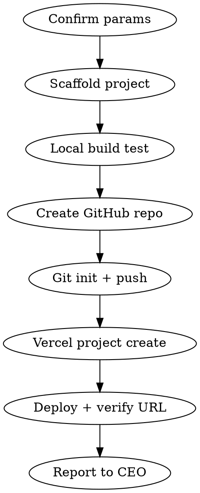

# Deploy Website

신규 웹사이트 프로젝트를 scaffolding부터 Vercel 배포까지 한번에 처리하는 워크플로우.

## Parameters

| 파라미터 | 필수 | 기본값 | 설명 |
|---------|------|--------|------|
| project_name | O | - | 프로젝트/레포 이름 (kebab-case) |
| github_org | X | tensw | GitHub organization |
| vercel_team | X | tensw | Vercel team slug |
| template | X | next-minimal | 템플릿 (next-minimal, landing, bakeone-style) |
| base_dir | X | /Volumes/PRO-G40/app-dev | 프로젝트 생성 디렉토리 |
| reference_site | X | - | 참고할 크롤링 사이트 경로 (scraper/output/) |

## Workflow



### 1. Scaffold Project
```bash
cd $base_dir
npx create-next-app@latest $project_name --typescript --tailwind --eslint --app --use-npm --no-src-dir
```
- reference_site가 있으면 해당 사이트 구조/디자인 참고하여 페이지 생성
- 없으면 template에 맞는 기본 페이지 생성

### 2. Local Build Test
```bash
cd $base_dir/$project_name
npm run build
```
빌드 실패 시 수정 후 재시도. 배포 전 반드시 통과.

### 3. GitHub Repo 생성 + Push
```bash
cd $base_dir/$project_name
git init && git add -A && git commit -m "Initial commit"
gh repo create $github_org/$project_name --public --source=. --remote=origin --push
```

### 4. Vercel 배포
```bash
cd $base_dir/$project_name
vercel link --yes --project=$project_name --scope=$vercel_team
vercel --prod
```

### 5. 결과 보고
- GitHub URL
- Vercel 배포 URL
- 빌드 상태

## Common Mistakes
- `npm run build` 안 하고 바로 push → Vercel 빌드 실패
- Vercel team scope 빠뜨림 → 개인 계정에 배포됨
- reference_site 참고 시 이미지 경로 깨짐 → public/에 복사 필요
