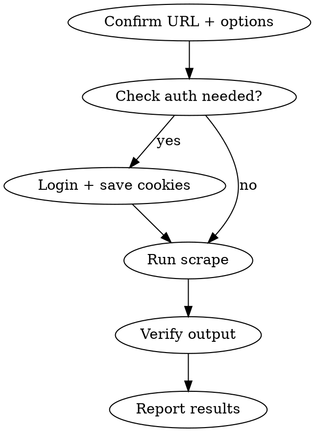

# Scrape Website

타겟 웹사이트를 scraper CLI로 크롤링하여 로컬에 저장하는 워크플로우.

## Scraper 위치
- **프로젝트**: `/Volumes/PRO-G40/app-dev/scraper`
- **CLI**: `npx tsx src/index.ts <command> [options]`
- **출력**: `output/<도메인>/` (HTML, CSS, JS, 이미지, 폰트 전부 포함)

## Parameters

| 파라미터 | 필수 | 기본값 | 설명 |
|---------|------|--------|------|
| url | O | - | 크롤링할 URL |
| depth | X | 3 | 크롤링 깊이 |
| max_pages | X | 100 | 최대 페이지 수 |
| concurrency | X | 3 | 동시 탭 수 |
| output | X | ./output | 출력 디렉토리 |
| auth | X | - | 로그인 필요 시 (username/password 또는 cookies) |

## Workflow



### 1. 파라미터 확인
- URL 유효성 확인
- 로그인 필요 여부 확인 (인증 필요하면 Step 2 진행)

### 2. 로그인 (필요 시)
```bash
cd /Volumes/PRO-G40/app-dev/scraper

# 방법 A: 자동 로그인
npx tsx src/index.ts scrape $url -u $username -p $password

# 방법 B: 수동 로그인 → 쿠키 저장
npx tsx src/index.ts login $url --cookies ./cookies.json
# 브라우저에서 직접 로그인 후 Enter

# 방법 C: 자격증명 파일
npx tsx src/index.ts scrape $url --creds-file ./creds.json
```

### 3. 스크래핑 실행
```bash
cd /Volumes/PRO-G40/app-dev/scraper
npx tsx src/index.ts scrape $url -d $depth -m $max_pages -c $concurrency -o $output
```
- 중단(Ctrl+C) 후 재실행하면 이전 진행 상태에서 이어서 크롤링
- `--force` 옵션으로 처음부터 다시 시작 가능

### 4. 결과 확인
```bash
# 저장된 사이트 목록
ls output/

# manifest 확인 (크롤링 메타데이터)
cat output/<도메인>/manifest.json

# 페이지 수, 자산 수 체크
```

### 5. 로컬 서빙 (선택)
```bash
npx tsx src/index.ts serve output/<도메인> -p 3000
# http://localhost:3000 에서 확인
```

### 6. 결과 보고
- 크롤링된 페이지 수
- 저장 경로
- 주요 페이지 목록 (manifest 기반)

## WordPress 사이트 (WP REST API 추출)
```bash
# 쿠키 기반 인증
npx tsx src/index.ts login $url
npx tsx src/index.ts extract $url --cookies ./cookies.json

# 특정 카테고리만
npx tsx src/index.ts extract $url --cookies ./cookies.json --categories 1,5,12
```

## 배포 검증 (verify)
스크래핑한 사이트를 배포 후 검증할 때:
```bash
npx tsx src/index.ts verify $deployed_url --sitemap
npx tsx src/index.ts verify $deployed_url --sitemap --click-explore  # 클릭 기반 심층 검증
```

## 기존 크롤링 데이터
| 폴더 | 사이트 |
|------|--------|
| biz-giftishow | 비즈 기프티쇼 |
| book-skku | 성균관대 도서관 |
| book-skku-data | 성균관대 도서관 데이터 |
| book-test | 테스트 도서 사이트 |
| koreanairdfs | 대한항공 면세점 |

별도 경로: `/Volumes/PRO-G40/app-dev/clone-site-bakeone/scraper/output/` — bakeOne IT 사이트

## Common Mistakes
- scraper 디렉토리가 아닌 다른 곳에서 CLI 실행 → 모듈 못 찾음
- 로그인 필요 사이트에서 인증 없이 크롤링 → 로그인 페이지만 수집됨
- `--force` 없이 재시작하면 이전 진행에서 이어감 (의도적 설계)
- 동시성(`-c`) 너무 높으면 서버에서 차단될 수 있음 → 3~5 권장
