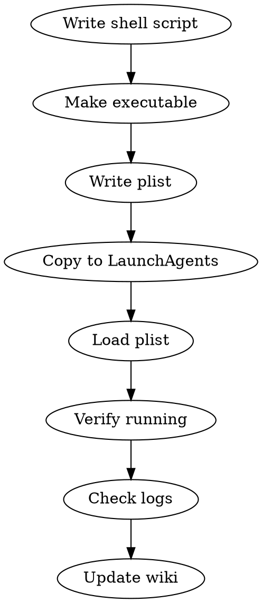

# Setup LaunchD Scheduler

macOS launchd를 사용한 로컬 스케줄러 등록 워크플로우.
**정책: crontab 사용 금지. 모든 로컬 스케줄러는 launchd 전용.**

## Parameters

| 파라미터 | 필수 | 기본값 | 설명 |
|---------|------|--------|------|
| name | O | - | 스케줄러 이름 (reverse-domain, e.g., com.willow.task-name) |
| script_path | O | - | 실행할 스크립트 경로 |
| schedule | O | - | 실행 주기 (시간/분 또는 interval) |
| working_dir | X | /Volumes/PRO-G40/app-dev/willow-invt | 작업 디렉토리 |

## plist Location
```
~/Library/LaunchAgents/
```

## Current Schedulers

| 이름 | plist | 스케줄 |
|------|-------|--------|
| 텔레그램 봇 | com.willow.telegram-bot.plist | 부팅 시 + 항상 실행 |
| 네이버 매물 크롤러 | com.willow.naver-listings.plist | 매일 08:00 |
| 부동산 시세 리포트 | com.willow.real-estate-report.plist | 매일 08:30 |
| 포트폴리오 모니터 | com.willow.portfolio-monitor.plist | 5분 간격 |

## Workflow



### 1. Shell Script 작성
```bash
#!/bin/bash
# scripts/run-{task-name}.sh
cd /Volumes/PRO-G40/app-dev/willow-invt
# 로그 디렉토리
mkdir -p scripts/logs

# 실행 (npx tsx 또는 직접 실행)
npx tsx scripts/{script-name}.ts >> scripts/logs/{task-name}.log 2>&1
```

### 2. 실행 권한
```bash
chmod +x scripts/run-{task-name}.sh
```

### 3. plist 작성
```xml
<?xml version="1.0" encoding="UTF-8"?>
<!DOCTYPE plist PUBLIC "-//Apple//DTD PLIST 1.0//EN" "http://www.apple.com/DTDs/PropertyList-1.0.dtd">
<plist version="1.0">
<dict>
    <key>Label</key>
    <string>com.willow.{task-name}</string>
    <key>ProgramArguments</key>
    <array>
        <string>/bin/bash</string>
        <string>/Volumes/PRO-G40/app-dev/willow-invt/scripts/run-{task-name}.sh</string>
    </array>
    <key>WorkingDirectory</key>
    <string>/Volumes/PRO-G40/app-dev/willow-invt</string>

    <!-- 시간 기반 스케줄 -->
    <key>StartCalendarInterval</key>
    <dict>
        <key>Hour</key>
        <integer>8</integer>
        <key>Minute</key>
        <integer>0</integer>
    </dict>

    <!-- 또는 간격 기반 (초 단위) -->
    <!-- <key>StartInterval</key><integer>300</integer> -->

    <!-- 또는 항상 실행 (데몬) -->
    <!-- <key>KeepAlive</key><true/> -->
    <!-- <key>RunAtLoad</key><true/> -->

    <key>StandardOutPath</key>
    <string>/Volumes/PRO-G40/app-dev/willow-invt/scripts/logs/{task-name}.log</string>
    <key>StandardErrorPath</key>
    <string>/Volumes/PRO-G40/app-dev/willow-invt/scripts/logs/{task-name}.log</string>
    <key>EnvironmentVariables</key>
    <dict>
        <key>PATH</key>
        <string>/usr/local/bin:/usr/bin:/bin:/opt/homebrew/bin</string>
    </dict>
</dict>
</plist>
```

### 4. 등록 및 로드
```bash
# 기존 것 있으면 먼저 언로드
launchctl bootout gui/$(id -u) ~/Library/LaunchAgents/com.willow.{task-name}.plist 2>/dev/null

# 복사 + 로드
cp com.willow.{task-name}.plist ~/Library/LaunchAgents/
launchctl bootstrap gui/$(id -u) ~/Library/LaunchAgents/com.willow.{task-name}.plist
```

### 5. 확인
```bash
# 상태 확인
launchctl print gui/$(id -u)/com.willow.{task-name}

# 로그 확인
tail -20 scripts/logs/{task-name}.log
```

### 6. 위키 업데이트
스케줄러 현황 위키 노트에 새 스케줄러 추가.

## Common Mistakes
- crontab 사용 → 정책 위반, 반드시 launchd 사용
- PATH 환경변수 누락 → node/npx 못 찾음
- 실행 권한 안 줌 → Permission denied
- bootout 없이 bootstrap → 중복 로드 에러
- WorkingDirectory 누락 → 상대 경로 깨짐
