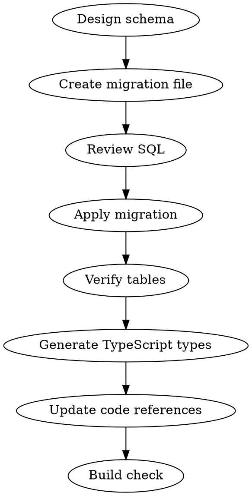

# Supabase Migration

Supabase DB 스키마 변경을 migration 파일 생성부터 타입 생성까지 처리하는 워크플로우.

## Parameters

| 파라미터 | 필수 | 기본값 | 설명 |
|---------|------|--------|------|
| project | O | - | Supabase 프로젝트 (experiment-apps, project-supernova, review-notes) |
| description | O | - | 변경 내용 설명 |
| tables | X | - | 생성/수정할 테이블 목록 |

## Project Info

| 프로젝트 | ID | 용도 |
|----------|-----|------|
| experiment-apps | axcfvieqsaphhvbkyzzv | Wiki, Tensw, CEO 문서, 부동산 |
| project-supernova | iiicccnrnwdfawsvbacu | Akros ETF |
| review-notes | kumaqaizejnjrvfqhahu | ReviewNotes 앱 |

## Workflow



### 1. 스키마 설계
- 기존 테이블 구조 확인 (MCP `list_tables` 또는 `execute_sql`)
- 새 테이블/컬럼 설계, 관계 정의
- RLS 정책 필요 여부 판단

### 2. Migration 파일 생성
```bash
# 파일명 규칙: YYYYMMDDHHMMSS_description.sql
# 경로: supabase/migrations/
cat > supabase/migrations/$(date +%Y%m%d%H%M%S)_${description}.sql << 'SQL'
-- migration SQL here
SQL
```

### 3. Migration 적용
MCP `apply_migration` 도구 사용:
- name: 마이그레이션 설명
- query: SQL 문
- project_id: 대상 프로젝트 ID

### 4. 테이블 검증
```sql
-- MCP execute_sql로 확인
SELECT column_name, data_type, is_nullable
FROM information_schema.columns
WHERE table_name = 'target_table';
```

### 5. TypeScript 타입 생성
MCP `generate_typescript_types` 도구 사용:
- project_id: 대상 프로젝트 ID
- 생성된 타입을 `src/types/` 또는 관련 파일에 반영

### 6. 빌드 확인
```bash
cd /Volumes/PRO-G40/app-dev/willow-invt
npx tsc --noEmit
```

## RLS 정책 패턴
```sql
-- 서비스 키 전용 (API route에서만 접근)
ALTER TABLE table_name ENABLE ROW LEVEL SECURITY;
CREATE POLICY "Service role access" ON table_name
  FOR ALL USING (auth.role() = 'service_role');

-- 공개 읽기
CREATE POLICY "Public read" ON table_name
  FOR SELECT USING (true);
```

## Common Mistakes
- migration 파일 없이 직접 SQL 실행 → 히스토리 추적 불가
- RLS 활성화 안 함 → 보안 취약
- TypeScript 타입 업데이트 누락 → 런타임 에러
- 인덱스 누락 → 대량 데이터에서 성능 저하
