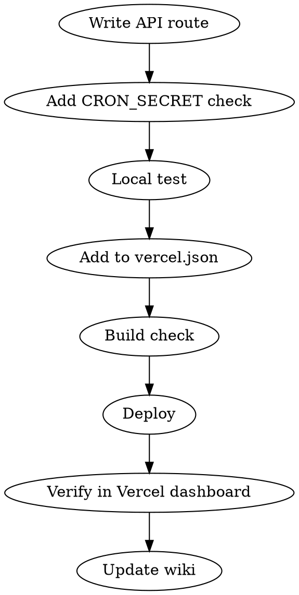

# Vercel Cron Setup

Vercel 서버리스 크론잡을 추가하는 워크플로우.

## Parameters

| 파라미터 | 필수 | 기본값 | 설명 |
|---------|------|--------|------|
| name | O | - | 크론잡 이름 |
| path | O | - | API route 경로 (e.g., /api/cron/task-name) |
| schedule | O | - | cron 표현식 (UTC 기준) |
| description | O | - | 크론잡 설명 |

## Current Crons

| 이름 | 경로 | 스케줄 (UTC) | KST |
|------|------|-------------|-----|
| 방치 감지 | /api/cron/stale-tasks | 0 0 * * 1-5 | 평일 09:00 |
| 부동산 싱크 | /api/cron/real-estate-sync | 13 22 * * * | 매일 07:13 |

## Workflow



### 1. API Route 작성
```typescript
// src/app/api/cron/{task-name}/route.ts
import { NextResponse } from 'next/server';

export async function GET(request: Request) {
  // CRON_SECRET 검증
  const authHeader = request.headers.get('authorization');
  if (authHeader !== `Bearer ${process.env.CRON_SECRET}`) {
    return NextResponse.json({ error: 'Unauthorized' }, { status: 401 });
  }

  try {
    // 비즈니스 로직

    return NextResponse.json({ success: true, message: '처리 완료' });
  } catch (error) {
    console.error('Cron error:', error);
    return NextResponse.json({ error: String(error) }, { status: 500 });
  }
}
```

### 2. vercel.json에 크론 등록
```json
{
  "crons": [
    {
      "path": "/api/cron/{task-name}",
      "schedule": "0 0 * * 1-5"
    }
  ]
}
```

**주의**: 스케줄은 UTC 기준. KST = UTC + 9.
- KST 09:00 = UTC 00:00
- KST 07:13 = UTC 22:13 (전날)

### 3. 환경 변수 확인
```bash
# CRON_SECRET이 Vercel에 설정되어 있는지 확인
vercel env ls | grep CRON_SECRET
```

### 4. 로컬 테스트
```bash
# 직접 호출하여 테스트
curl -H "Authorization: Bearer $CRON_SECRET" http://localhost:3000/api/cron/{task-name}
```

### 5. 배포
```bash
vercel --prod
```

### 6. 위키 업데이트
스케줄러 현황 위키 노트에 새 크론 추가.

## Time Conversion Quick Reference

| KST | UTC | cron (UTC) |
|-----|-----|------------|
| 07:00 | 22:00 (전날) | 0 22 * * * |
| 09:00 | 00:00 | 0 0 * * * |
| 12:00 | 03:00 | 0 3 * * * |
| 15:00 | 06:00 | 0 6 * * * |
| 18:00 | 09:00 | 0 9 * * * |

## Common Mistakes
- UTC/KST 혼동 → 9시간 차이 실수
- CRON_SECRET 미설정 → 401 에러
- vercel.json 기존 crons 덮어쓰기 → 배열에 추가해야 함
- Vercel Hobby 플랜은 일 1회 제한 → Pro 플랜 필요 시 확인
- 환경변수 추가 시 printf 사용 (echo 금지 — \n 붙음)
